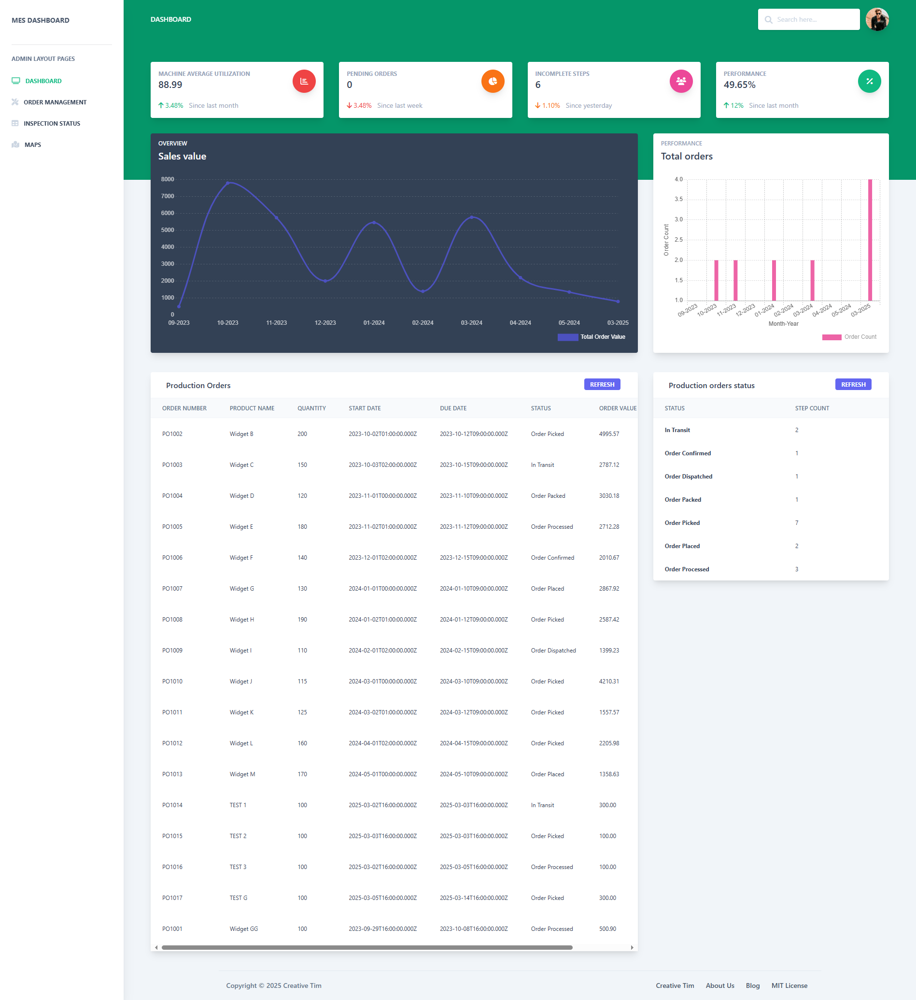
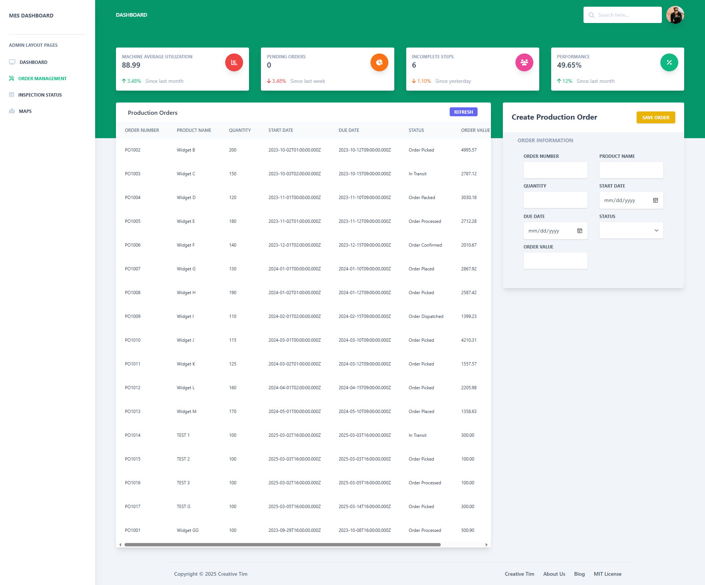
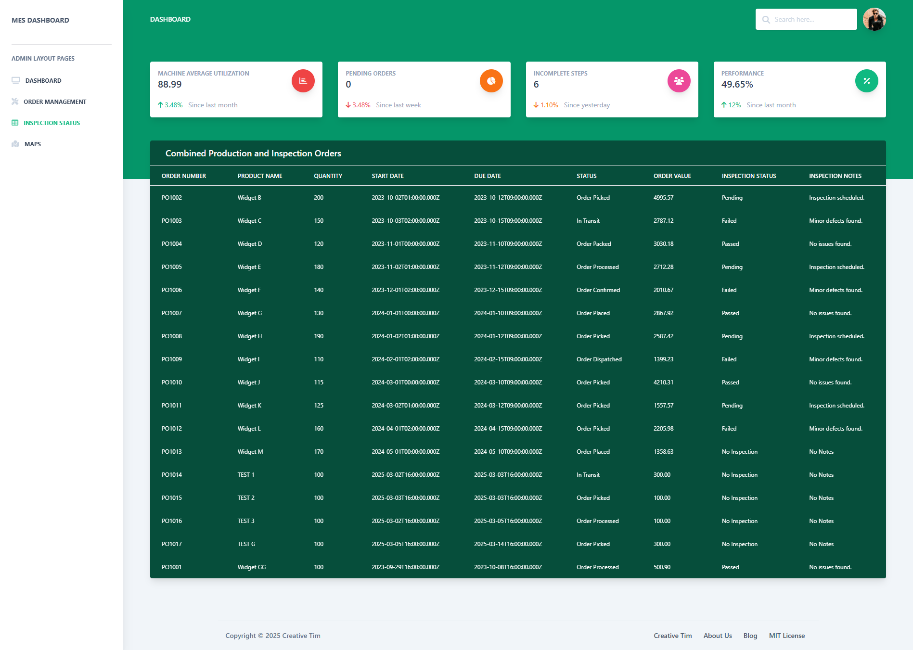

# Aresious Company MES

A Manufacturing Execution System (MES) for managing production orders, quality inspections, machine utilization, and production steps.

## Dashboard Screenshots


### Order Management


### Inspection Status Dashboard


## Prerequisites

Ensure you have the following installed on your system:
- **Node.js v22.14.0**
- **PostgreSQL v17**
- **npm** (comes with Node.js)
- **Docker** (optional, for containerized deployment)


## Steps to Run the Project

### 1. Clone the Repository

```bash
git clone https://github.com/ming0520/aresiouscompany-mes.git
cd aresiouscompany-mes
```

### 2. Install Dependencies

Run the following commands to install dependencies for both frontend and backend:

```bash
cd mes-frontend && npm install
cd ../mes-backend && npm install
```

### 3. Set Up the Database

1. Create a PostgreSQL database named `mes_db`.
2. Update the database connection settings in `mes-backend/config/database.js` or use environment variables.
3. Run migrations (if applicable) using a tool like Knex or Sequelize.

### 4. Start the Servers

Run both the frontend and backend servers:

```bash
# Start the backend server
cd mes-backend
npm start   # or use 'npm run dev' for development mode

# Start the frontend server
cd ../mes-frontend
npm run serve
```

### 5. Access the Application

- **Frontend:** [http://localhost:8080](http://localhost:8080)
- **Backend API:** [http://localhost:3001](http://localhost:3001)

---

## Project Structure

```
aresiouscompany-mes/
├── mes-frontend/           # Frontend (Vue.js)
│   ├── public/            # Static assets
│   ├── src/               # Source code
│   │   ├── assets/        # Images, styles, etc.
│   │   ├── components/    # Reusable Vue components
│   │   ├── views/         # Main views/pages
│   │   ├── App.vue        # Root component
│   │   ├── main.js        # Entry point
│   │   └── router.js      # Vue Router configuration
│   └── package.json       # Frontend dependencies
├── mes-backend/            # Backend (Express.js)
│   ├── config/            # Configuration files
│   ├── controllers/       # API controllers
│   ├── models/            # Database models
│   ├── routes/            # API routes
│   ├── middleware/        # Custom middleware
│   ├── app.js             # Main application file
│   └── package.json       # Backend dependencies
├── docker-compose.yml      # Docker configuration (optional)
└── README.md               # Project documentation
```

---

## API Endpoints

### Production Orders

- `GET /production/orders` - Fetch all production orders.
- `POST /production/orders` - Create a new production order.
- `GET /production/orders/grouped-by-status` - Count production orders grouped by status.
- `GET /production/orders/grouped-by-month-year` - Get production orders grouped by month-year.
- `GET /production/orders/value-by-month-year` - Get total order value grouped by month-year.
- `GET /production/orders/pending-sum` - Get the sum of pending production orders.
- `PUT /production/orders/:id` - Update a production order.
- `DELETE /production/orders/:id` - Delete a production order.

### Quality Inspections

- `GET /quality/inspections/` - Get all quality inspections.
- `GET /quality/inspections/:orderId` - Get all quality inspections for a specific order.
- `POST /quality/inspections` - Add a new quality inspection.
- `PUT /quality/inspections/:id` - Update a quality inspection.

### Defects

- `GET /quality/inspections/:inspectionId/defects` - Get all defects for a specific inspection.
- `POST /quality/defects` - Add a new defect.
- `DELETE /quality/defects/:id` - Delete a defect.

### Machine Utilization

- `GET /metrics/machine-utilization` - Get machine utilization data.
- `GET /metrics/average-machine-utilization` - Get average machine utilization.

### Production Steps

- `GET /production/steps` - Get all production steps.
- `POST /production/steps` - Create a new production step.
- `GET /production/steps/grouped-by-status` - Count production steps grouped by status.
- `PUT /production/steps/:id` - Update a production step.
- `DELETE /production/steps/:id` - Delete a production step.
- `GET /production/steps/incomplete-count` - Get the count of incomplete production steps.

---

## To Be Improved in Future 🚀

### Backend Enhancements

- **Use Object-Oriented Programming (OOP):** Refactor the backend to split data structures into reusable models.
- **Move hardcoded API URLs to `env.js`:** Use environment variables for different development and production environments.
- **Replace hardcoded database credentials:** Use `.env` or `config.js` for better security and flexibility.
- **Implement better error handling:** Add middleware for centralized error handling.
- **Use a structured logging system:** Implement a logging framework like Winston or Morgan.

### Frontend Enhancements

- **Improve state management:** Consider using Vuex or Pinia for better state handling.
- **Enhance UI/UX:** Implement better design components and animations.
- **Optimize performance:** Lazy load components and minimize unnecessary re-renders.
- **Implement unit and integration testing:** Use Jest for testing frontend components.

### Deployment & Scaling

- **Containerize the application:** Use Docker for easier deployment.
- **Set up CI/CD pipelines:** Automate testing and deployment.
- **Improve database indexing:** Optimize queries for better performance.
- **Implement authentication and authorization:** Add role-based access control (RBAC).

---

## Contributing

Contributions are welcome! If you'd like to contribute, please follow these steps:

1. Fork the repository.
2. Create a new branch for your feature or bugfix.
3. Commit your changes.
4. Submit a pull request.

---

## License

This project is licensed under the MIT License. See the `LICENSE` file for details.

For any questions or issues, please open an issue on the GitHub repository or contact the maintainers.

